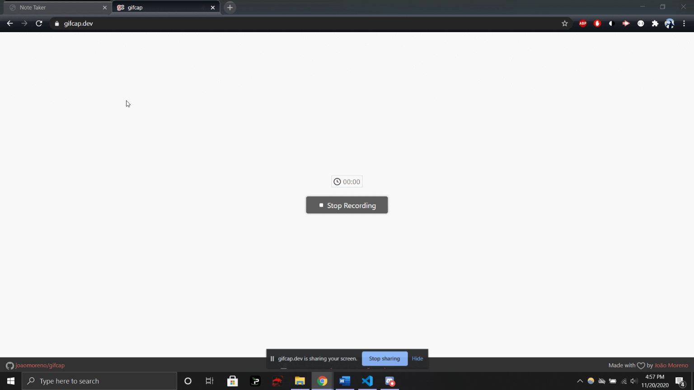

# NoteTaker

## To Use: https://notetaker11uncral.herokuapp.com/public/index.html for web link, or download github repo and install express, then "node server.js"

### An application utilizing Express to allow the user to take notes. Deployed via Heroku.

Initial Commit ---------------------
Started skeleton of server and linking html and api js files
API Get/Post functions added
--------------- Fixed delete function errors and linked properly now
All working on localhost, need to push to heroku

-----App running --------
adding screenshot gif and instructions
